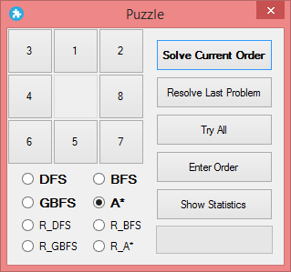
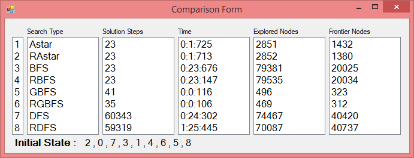
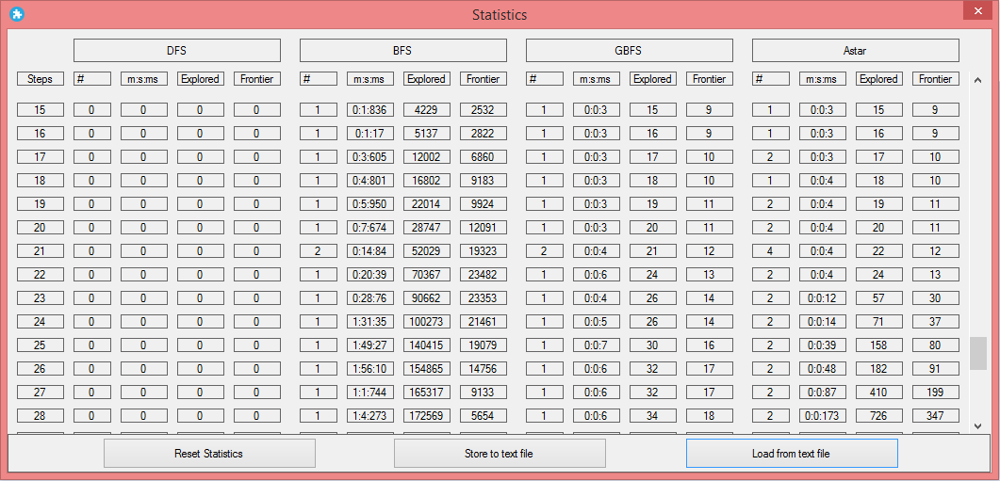

# EightDigitsPuzzle
Eight digits puzzle implementation using Various AI Algorithms.

# Artificial Intelligence

**Project about**

# Problem Solving by Searching Algorithms Applied on &#39;Puzzle Game&#39;

**Teamwork**

**Ahmed Abdelbasit**

**Mahmoud Shaheen**

Part 1: Abstract:

        In the field of problem solving there are many problems that can be solved by searching. We worked on the 8-number Puzzle. The problem is a given sequence by which the numbers from 1 to 8 are arranged in the square. The goal is to reorder these numbers by following the game&#39;s rules.

 

Figure 1.1: describing a problem and the goal to be achieved

        We provided four types of searching algorithms to be used in this problem; Depth First Search (DFS), Breadth First Search (BFS), Greedy Best First search (GBFS) and A-star (A\*). Statistics and comparison between types are also included. Results of our work is that the algorithms which are guaranteed to obtain the optimal path are (BFS) and (A\*). The fastest algorithm to get a solution is the (GBFS) and (A\*) comes after (GBFS) in the speed. DFS is neither optimal nor fast.

        Some modifications are provided to increase the efficiency like using Binary Search for searching operations in the explored set and frontier. This lowered time complexity of all algorithms too much. Moreover, Randomness was included in the order by which children of some parent are generated. This in some cases has a good effect with DFS, BFS and GBFS.

Part 2: Introduction and theoretical background:

        In problem solving by searching there are two main types of algorithms; uniformed searching algorithms and informed ones. Uninformed searching algorithm only has the information provided by the problem formulation. Informed searching algorithm has additional information that allows it to judge the promise of an action, i.e., the estimated cost from a state to a goal. So, it is more intelligent than uninformed type. In this project, BFS and DFS are examples for uninformed algorithms. GBFS and A\* are examples for informed algorithms.

Part 3: Puzzle Problem Formulation:

        For a problem to be solved by searching, it must be fully formulated by five components; Initial state, goal test, available actions, transition model and path cost. In our problem, i.e. 8-Puzzle, these components are maintained as follow:

1. Initial state.

        The initial sequence of numbers from 0 to 8 given by user at the beginning.

1. Available actions.

At each state, there is a set of available actions that follow the game rules. The main rule is that a tile can only move when the blank tile is adjacent to it. For example, in the following state the available actions are: Up, Down and Left.

 

Figure

1. Transition Model.

At any state when an action is applied, what is the resulting new state!! For example, the following figure shows a parent for which LEFT action was taken and a child state was generated.

 
Figure

1. Goal Test.

It can determine whether the current state achieves the goal sequence or not. In our problem the goal is represented by the following order:

Figure

1. Step/ Path cost.

        In this problem there is a constant step cost from a parent state to any of its generated children, so the path cost represents the number of moves done from the initial state to reach the current state.

Part 4: Project GUI:

        It consists of five forms; the Main Form, User Input Form, Result Form, Comparison Form and Statistics Form.

1. Main Form

        This form is the starting one that represent the main control unit of the program. The first part of it is the buttons of numbers. The user can move them by following the moves rule to form the initial state of the problem otherwise he can use the User Input Form for this operation by clicking &#39;Enter Order&#39; button.

        The second part is the set of radio buttons by which the user selects the desired algorithm to be operated on the problem. There are four algorithms and their random versions. This part will be discussed in Modification Part.

 

Figure ()

        The last part of this form is a set of buttons that control the flow of program. The first button &#39;Solve Current Order&#39; creates a problem with an initial state of the current order of buttons in this form and solve it with the selected algorithm, then it sends data about the solution to the Result Form. The second button &#39;Resolve Last Problem&#39; resolves the last problem created and the user can change the algorithm to be applied. The &#39;Try All&#39; button creates a problem of current order and solve it with all algorithms and sends data about solution of each one to the Comparison Form. The &#39;Enter Order&#39; button shows the User Input Form so that the user enter the order of the problem initial state. The last button &#39;Show Statistics&#39; opens the Statistics form.

1. User Input Form

        This form provides an easy way for user to enter the initial state of the problem. User just click on the button on the right side of the form to move it in the first blank space in the square at left side. The square must be fully filled to send the order to the main form.

 

Figure ()

        The &#39;Check Solvability&#39; button can be used to check if the entered order or not. Its function will be discussed later in Part 7.4.

1. Result Form

        The main objective of this form is to provide the results of the solution given by the applied algorithm. These information involves the time elapsed to reach the goal, the number of visited and expanded states, the number of nodes remaining in the frontier without expansion and the path cost from the initial state to the goal.

        It also provides a visual manner to follow the solution steps. A manual method is provided by the &#39;Next Step&#39; button. When clicked, a move from the solution list is taken to walk toward the goal. Another method is provided by the &#39;Auto Solve&#39; button. When clicked, moves of the solution are taken periodically by a timer until the goal is reached. A solution list in the left side shows the visited states from the initial state to the goal. The following figure shows the Result form.

 

Figure ()

1. Comparison Form

        This form appears when the &#39;Try All&#39; button in the main form is clicked. It provides the data about each algorithm&#39;s solution. This is useful to make a comparison between the algorithms performance on the same problem and give a judge on each one. The following figure shows a comparison for algorithms performance on a problem with initial state = {0,1,2,4,6,5,3,7,8}.

 

Figure ()

1. Statistics Form

        This form keeps track of all trials performed on the application and saves the data about solution. These data include the used algorithm, time elapsed, path cost, frontier and explored set size. For multiple trials of same path cost, it calculates the average values of all included data. The following figure shows the form containing some data after many trials of different path costs problems.

 

Figure ()

Part 5: Special Data Structure Implementation

        In this part, we will introduce the data structure classes used in our application. Each class contains some data types and function that ae mainly used and some other auxiliary functions implemented to maintain the modularity of the code.

1. Problem Class

Main Components:

1.
  1. Private Initial-State (8) As Integer

        This array holds the initial state of the problem.

1.
  1. Private goal (8) As Integer

        This array contains the sequence to be reached as a goal.

1.
  1. Constructor (state)

This subroutine in invoked when an object of the problem class is to be generated. The initial state is passed as a parameter to it. It is possible to pass the goal as a second parameter and make the application deals with dynamic goal determined by the user.

1.
  1. Actions (node)

This function returns an array of Booleans representing the available actions that can be done at a specific node.

1.
  1. Goal-Test (node)

This function returns TRUE if the node&#39;s state is the goal of the problem and returns FALSE for any other case.

Auxiliary Components:

1. Available (node, action)

This is an auxiliary function invoked in Actions function. It tests whether it is possible to make an &#39;action&#39; at the &#39;node&#39; state or not.

1. Get-Initial-State ()

This function returns the initial state of the problem object invoking this function.

1. Node Class

Main Components:

1.
  1. Private state(8) As Integer
  2. Private parent As node
  3. Private action As Integer

        The action applied by the parent to generate this node.

1.
  1. Private Hofn As Integer

        The heuristic estimated value from this node to the goal.

1.
  1. Private Gofn As Integer

        The path cost from initial state to this node.

1.
  1. Private Fofn As Integer

        The evaluation value by which the node is ordered in priority frontier.

1.
  1. Constructor (State, Parent, Action, Path-Cost)

The subroutine executed when generating a node and used to initialize its components values.

1.
  1. Child-Node (Action)

The function called to generate a child node by applying an action to the parent.

1.
  1. Get-Solution ()

The function called when the goal state is reached to return the list of actions done from the goal to the initial state.

Auxiliary Components:

1. Get-State ()

        A function used to return the state array of the node.

1. Get-Parent ()

A function used to return the parent of the node. It is executed to return back the list of nodes visited on the path from the initial state to the goal.

1. Calculate-Hofn ()

A function called in the constructor subroutine and used to calculate the heuristic estimated number of moves from current state to the goal. It depends on problem relaxation and assuming that a tile can move from location A to location B if A and B are adjacent. It mainly calculated by subtracting (the number of moves a square should do to reach index 0 from its current location) from (the number of moves it should do to reach index 0 from its right location). This operation is done for all squares from 1 to 8.

1. Get-Row-DistanceTo0 (integer)

A function used to calculate the how many steps the square must move to reach its row 0.

1. Get-Col-DistanceTo0 (integer)

A function used to calculate the how many steps the square must move to reach its column 0.

1. Get-Fofn ()

        A function to return the value of evaluation function for the node.

1. Explored Set Class

Main Components:

1.
  1. Private extra as List (Of Integer)

A list to store the explored states in graph versions of searching algorithms.

1.
  1. Insert (node)

A function used to add explored states to the Set in order.

1.
  1. Is-Here (node)

A function to check if a node&#39;s state was explored before or not.

1.
  1. Count ()

A function to return the number of explored states after reaching the goal.

1.
  1. Clear ()

A function to reset the Explored Set and deletes all its content.

Auxiliary Components:

1. Add-State (state array)

This function is invoked in insert () function and used to encode the state of the node into an integer value and add to the list in order.

1. Bin-Search (start index, last index, state integer)

A function that is executed recursively to return the index at which a state was allocated (in Is-Here () function) or the index at which the state should be allocated (in Add-State () function).

1. FIFO / LIFO Frontier Class

Main Components:

1.
  1. Private f as Queue / Stack (Of node)

A queue is used with BFS to implement a FIFO frontier

A stack is used with DFS to implement a LIFO frontier

1.
  1. Insert (node)

A function called when a child node is generated and needed to be pushed in the frontier to be explored later.

1.
  1. Pop ()

A function called to explore a node and expand its children. For FIFO frontier the oldest node is returned while in LIFO frontier the newest node is returned.

1.
  1. Empty ()

A function to check if the frontier contains no more nodes to explore. The empty frontier indicates a no solution situation.

1.
  1. Is-Here (node)

A function used to determine if a node with the same state of the new node was inserted in the frontier. This used for graph versions of algorithms.

Auxiliary Components:

1. Private extra as List (Of Integer)

A list used to store states encoded in integer values and in order. The main purpose of it is to be able to apply binary search when inserting and searching for a state.

1. Add-State (state array)

A function invoked in insert () function and used to encode the state array in an integer value then, it uses Bin-Search function to allocate the state.

1. Bin-Search (start index, last index, state integer)

A function that is executed recursively to return the index at which a state was allocated (in Is-Here () function) or the index at which the state should be allocated (in Add-State () function).

1. Get-Count ()

A function used to return the number of nodes still queued in the frontier after the goal node was reached. Mainly used for giving statistics about the algorithm solution.

1. Priority Frontier Class

Main Components:

1.
  1. Private f as List (Of node)

A linked in which nodes are inserted and order by their evaluation function f (n).

1.
  1. Insert (node)

A function called when a child node is generated and needed to be pushed in the frontier to be explored later.

1.
  1. pop ()

A function called to explore a node and expand its children. For priority frontier, nodes are sorted so, the first node is always returned as it has the lowest evaluation value.

1.
  1. Empty ()

A function to check if the frontier contains no more nodes to explore. The empty frontier indicates a no solution situation.

1.
  1. Is-Here (node)

A function used to determine if a node with the same state of the new node was inserted in the frontier. This used for graph versions of algorithms.

1.
  1. replace (new node)

A function called whenever a node with the same state but has lower value of f (n) is to be inserted and replaces the node with higher f (n) in the frontier.

Auxiliary Components:

1. Private extra as List (Of Integer)

A list used to store states encoded in integer values and in order. The main purpose of it is to be able to apply binary search when inserting and searching for a state.

1. Add-State (state array)

A function invoked in insert () function and used to encode the state array in an integer value then, it uses Bin-Search function to allocate the state.

1. Get-Index ()
2. Bin-Search ()
3. Extra-Bin-Search ()
4. Test-Equality ()
5. Get-Count ()

1. Search Algorithm Class
  1. Private Root as node
  2. Private Node as node
  3. Private e-Set as Explored-Set = New Explored-Set
  4. Private Actions (3) As Boolean
  5. Private ACT as List (Of Integer) = New List (Of Integer)
  6. Private Child as node
  7. Private Frontier-Size as Integer = 0

1.
  1. Function DFS ()
  2. Function BFS ()
  3. Function GBFS ()
  4. Function Astar ()
  5. Function R\_DFS ()
  6. Function R\_BFS ()
  7. Function R\_GBFS ()
  8. .Function R\_Astar ()
  9. Function Get-Set-Count ()
  10. Function Get-Frontier-Count ()

Part 6: Proposed Algorithms

1. Breadth First Search

**Algorithm:**

**function** BFS ( problem )

-
  - Node = a node with state = problem.getInitialState ( )
  - **if** goalTest ( node )         **then return** solution ( )
  - frontier = a **FIFOfrontier** with node as the only element
  - eSet = an empty ExploredSet
  - **loop do**
    - **if** empty ( )         **then return** Nothing
    - node = frontier.pop ( )
    - insert ( node )
    - **for each** action **in** actions ( node ) **do**
      - child = node.childNode ( action )
      - **if** getState ( ) is not in explored and not in frontier         **then**
        - **if** goalTest ( child )         **then return** solution ( )
        - insert ( child )

Characteristics:

- --Uninformed
- --Optimal
- --Complete
- --Implements FIFO frontier

1. Depth First Search

Algorithm:

**function** DFS ( problem )

-
  - Node = a node with state = problem.getInitialState ( )
  - **if** goalTest ( node )         **then return** solution ( )
  - frontier = a **LIFOfrontier** with node as the only element
  - eSet = an empty ExploredSet
  - **loop do**
    - **if** empty ( )         **then return** Nothing
    - node = frontier.pop ( )
    - insert ( node )
    - **for each** action **in** actions ( node ) **do**
      - child = node.childNode ( action )
      - **if** getState ( ) is not in explored and not in frontier         **then**
        - **if** goalTest ( child )         **then return** solution ( )
        - insert ( child )

Characteristics:

- --Uninformed
- --Not-Optimal
- --Complete
- --Implements LIFO frontier

1. Greedy Best First Search

Algorithm:

**function GBFS ( problem ) returns**

-
  - node = node with state=problem.getInitialState, Gofn = 0
  - frontier = Priorityfrontier ordered by heuristic h , with node as only element
  - eSet = an empty ExploredSet
  - **loop do**
    - **if** frontier.empty ( )         **then**** return** Nothing
    - node = frontier.pop ( )
    - **if** problem.goalTest ( node )         **then**** return** node.solution ( )
    - insert ( node )
    - **for each** action in problem.actions ( node ) **do**
      - child = node.childNode ( action )
      - **if** child.getState ( ) is not in explored and **not** in frontier **then**
        - insert ( child )
      - **else**** if**child.getState ( ) is in frontier with higher h-value**then**
        - replace that frontier node with child

Characteristics:

- --Informed
- --Not-Optimal
- --Complete
- --Implements Priority frontier with f(n) = h(n)

1. A-star Search

Algorithm:

**function** Astar ( problem ) **returns**

-
  - node = node with state=problem.getInitialState, Gofn = 0
  - frontier = Priorityfrontier ordered by **evaluation** f , with node as only element
  - eSet = an empty ExploredSet
  - **loop do**
    - **if** empty ( )         **then return** Nothing
    - node = frontier.pop ( )
    - **if** goalTest ( node )         **then return** solution ( )
    - insert ( node )
    - **for each** action **in** actions ( node ) **do**
      - child = node.childNode ( action )
      - **if** getState ( ) is not in explored and not in frontier **then**
        - insert ( child )
      - **else if** getState ( ) is in frontier with higher h-value **then**
        - replace that frontier node with child

Characteristics:

- --Informed
- --Optimal
- --Complete
- --Implements Priority frontier with f(n) = h(n) + g(n)

Part 7: Applied Modifications:

1. Binary Search in Explored Set

        In graph version of search algorithms, the explored set is provided so that the visited and expanded nodes are added to it so that no state might be expanded more than once. So, for each visited node a search operation is done to determine whether this state is a new one or visited before. By ordinary &#39;Selection&#39; search that is done by a loop from the first element in the Explored Set to the last one, too much time is required and the more visited nodes, the larger the Explored Set size and the more waste of time. The time complexity for a search by Selection fashion is O(n²).

        We know two facts about the binary search; it must be applied to sorted list of elements and its time complexity is O(lgn). So, the first step is to keep the Explored Set sorted. This was done by encoding the states in integer form, i.e. for a state represented by the following array {1,5,0,4,8,7,2,6,3} the allocated state in Explored Set is 150487263. So all states are stored as integer values. By this way, for inserting a state Binary Search is used to get the index where the state will be allocated with time complexity O(lgn). And also Binary search is used to search for a state with time complexity O(lgn). This had a significant effect on all algorithms, e.g. for BFS with a problem of optimal path cost 29 moves, without Binary search the algorithm took 17 minutes and 3 seconds. With binary search the algorithm took only 1 minute and 9 seconds.

1. Binary Search in Frontier

        For the explored set, it only keeps track of the visited states, no care about how the state is reached. But in frontier, the data structure that is pushed are of Node type. Node consists of: its state, parent node, the action generated it, the path cost and the heuristic estimation value. Any parameter changing leads to changing the node identity. Moreover, in uninformed search algorithms like BFS and DFS, we cannot order the nodes because these algorithms depend on the order by which nodes queued in the frontier. So, there is not a straight forward way to operate binary search here.

        Instead, an extra list was used to keep track of the states of nodes allocated in the main frontier queue. Whenever a node is pushed in the queue, its state is extracted, encoded in an integer value and stored in the extra by using binary search to determine the index it must be inserted at to keep the list sorted. On the other hand, when a node is popped from the frontier, its state is extracted, binary search is used to get its index in the extra list and this state is removed from the extra list.

        The situation is much different in Informed Search Algorithms. That is because the frontier used with them is a priority queue with sorted with regard to the evaluation function f(n). For GBFS the evaluation function just depends on the heuristic estimation value h(n), and for A\* algorithm the evaluation function depends on both the path cost g(n) and the heuristic h(n). The problem here is how to sort nodes by f(n) using binary search. And if we managed to do that, how to search for a state using binary search although the states of nodes are not in order!!

        The problem of sorting states was solved by the same way followed in uninformed algorithms. An extra list was provided and states of nodes being pushed are extracted, inserted, searched and removed from the list using binary search. For the main frontier the following steps was used to insert a node in order:

1. use Binary Search to search for a node with f(n) larger by 1 than the value of the new node to be inserted
2. whenever a node is reached,
  - if f (node) = f (new node) +1 then,
    - go down the frontier until you reach the first node of value f(n) = f (new node) +1 and insert the new node before it.
  - If f(node) &gt; f (new node) +1 and the reached location is 0 then,
    - Just insert the node at this location.
  - If f (node) &gt; f (new node) +1 and the reached location is not 0 then,
    - go down the frontier until you reach the first node of value f(n) &gt; f (new node) +1 and insert the new node before it.
  - If f(node) &lt; f (new node) +1 then,
    - Just insert the node after this location.

        This strategy may seem to be difficult or not obvious but it had a significant effect on the performance of both A\* and GBFS algorithms. Results of using binary search will be provided in the next part.

1. Applying Randomness in algorithms.

        For the first time one can say that randomness cannot be used in these algorithms because the order by which node are queued in the frontier define the algorithm to be used. But in fact, the randomness intended does not concern the order of nodes. It just affects the order by which children of the same parent are generated. In the ordinary style, the available actions are checked in a fixed order depending on the code flow. The order of actions by which children are generated were: UP, DOWN, RIGHT and then LEFT. By picking a random action from the list of available actions, the flow of solution might change slightly in some algorithms and incredibly in the other. You can think about the following case where the DFS algorithm was used. If the random choices were UP then LEFT, the optimal solution is reached. But, recalling the fixed sequence, the solution will go too far.

 

Figure ()

        But this scenario is not guaranteed to be good at all situations, if the situation is reversed and the goal was in the fixed order, introducing randomness might cause the algorithm to deviate too far from the goal. Results of providing Randomness on the four algorithms will be discussed in the next part.

1. Solvability of problem:

        For the 8-Puzzle problem, having 9 squares with each of them a number from 0 to 8 can be put, there are 9^9 probabilities. Put in our case we deal with permutations. So, there are 9! possible probabilities to be set by user. This set of possible permutation is divided into two equal subsets. This means that there are 181440 reachable states and another 181440 unreachable states. We reached this fact when we entered a random sequence and got the following result by using BFS algorithm:

 

Figure ()

        For this reason, we need a method to determine whether the input sequence is solvable or not. The first strategy we followed was to apply GBFS with time expired 5 seconds. GBFS is fast and can solve any problem within a second. So, if 5 seconds passed without a solution this means that the goal cannot be reached from that initial state. This analogy worked well for all trials we have done.

        Then, after we searched for the solvability of 8-Puzzle, we got a more suitable solution. The reference of the web page we got the method from is mentioned in Part 10-1. The method depends on calculating how many inversions are there in the initial state. An inversion is when a tile precedes another tile with a lower number on it. The solution state has zero inversions. For a grid of odd width, the polarity of the number of inversions is invariant. That means: all legal moves preserve the polarity of the number of inversions. So, for our problem, all states with even number of inversions all located in the reachable subset of permutations.

Part 8: Results and Comparisons

        Here are some comparisons between algorithms for three problems.

 

(a)

(b)

 

(c)

Figure () shows comparison between algorithms&#39; solution for three different problems. Time is represented in form (minutes: seconds: milliseconds)

Part 9: Conclusion and Comments

        At the end of our work and from the results of randomly chosen problems we obtained the following conclusion about the performance of each algorithm:

1. For Breadth First Search Algorithm:

        This algorithm is guaranteed to get the optimal solution wherever there is a possible solution. But it is slow because it expands the shallowest node and does not matter if this node may lead to the goal or not i.e. it is uninformed algorithm.

1. For Depth First Search Algorithm

        This algorithm is a bad choice in this problem i.e. 8-Puzzle. It takes too much time and the solution path cost is incredible. It is also the most affected algorithm by attaching randomness. But it is not guaranteed that randomness always has a good effect. Sometimes it causes the algorithm to go away from the goal node which it would have expanded it if the fixed order of generating children was used.

1. For A-star Searching Algorithm:

        This algorithm is best choice for this problem. It is guaranteed to get the optimal solution in too much less time compared to BFS algorithm. With many trials, the longest path cost was 29 moves and it was obtained within 3 seconds on average.

1. For Greedy Best First Search Algorithm

        This algorithm is a good choice whenever a fast solution is needed and no care about optimality. It is the fastest algorithm to get a solution and the lowest in memory usage. It is not guaranteed to get the optimal solution, however, in many cases it obtains it.

1. For Using Graph Version of Algorithms:

        Graph versions have much less space and time complexity than tree versions. At the beginning of our work we tried a tree version for BFS and A\* Algorithms. For a problem with optimal path cost of 12 moves, BFS took 45 minutes to solve it. A\* was faster and for a problem with optimal path cost of 22 moves it took about an hour to solve it.

1. For providing Binary search:

        Binary search has a significant effect on the performance of all algorithms. It lowers the time complexity of inserting and searching for a node in the explored set and frontier from O(n²) to O(lgn). After using binary search, the no solution cases were fully resolved within 2 minutes at most for all algorithms. No solution case means that algorithms explored exactly 181440 state.

1. For introducing Randomness in Children Generation:

        Randomness has no effect on A\* algorithm. The main reason is that A\* does not matter which children is generated first because the frontier is a priority queue and nodes are queued with regard to both its heuristic and path cost value.

        GBFS is sometimes affected by randomness because nodes are queued in frontier with regard to the heuristic estimation only. So, for nodes with equal h the first to be generated will be expanded first. This affects the number of explored nodes, the number of nodes queued in frontier and the solution path cost itself. Referring to figure () for the comparison form, you can see that the random version of GBFS changed the path cost from 41 to 35 moves. Sometimes it might change the path cost to the optimal one. But it is not guaranteed that the effect of Randomness is always good. But on average randomness improves the GBFS performance.

        For both BFS and DFS, Randomness might cause a better or worse performance. But BFS is slightly affected because the range by which the number of explored nodes may be changed depends on the number of nodes in the level containing the goal. For longer path cost the range increases.

        On the other hand, for DFS it is incredibly affected because just one node change causes the algorithm to go too far from the goal. But also this incredible change might be good or bad. The following figures show both a good and bad effect in DFS.

 

(a)

# LICENSE

The MIT License (MIT)

Copyright © 2017 Mahmoud Shaheen

Permission is hereby granted, free of charge, to any person obtaining a copy
 of this software and associated documentation files (the "Software"), to deal
 in the Software without restriction, including without limitation the rights
 to use, copy, modify, merge, publish, distribute, sublicense, and/or sell
 copies of the Software, and to permit persons to whom the Software is
 furnished to do so, subject to the following conditions:

The above copyright notice and this permission notice shall be included in all
 copies or substantial portions of the Software.

THE SOFTWARE IS PROVIDED "AS IS", WITHOUT WARRANTY OF ANY KIND, EXPRESS OR
 IMPLIED, INCLUDING BUT NOT LIMITED TO THE WARRANTIES OF MERCHANTABILITY,
 FITNESS FOR A PARTICULAR PURPOSE AND NONINFRINGEMENT. IN NO EVENT SHALL THE
 AUTHORS OR COPYRIGHT HOLDERS BE LIABLE FOR ANY CLAIM, DAMAGES OR OTHER
 LIABILITY, WHETHER IN AN ACTION OF CONTRACT, TORT OR OTHERWISE, ARISING FROM,
 OUT OF OR IN CONNECTION WITH THE SOFTWARE OR THE USE OR OTHER DEALINGS IN THE
SOFTWARE.
